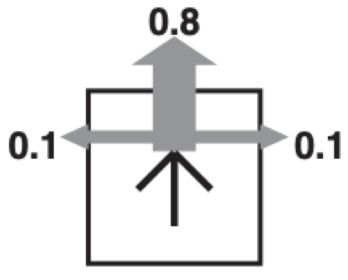

# Markov-Descision-ProcAI
# Description

The program is a modularized code that has been implemented using Python. The goal was to implement Value Iteration for grid world Markov Descision Problems and observe the effects of different parameters on policies.

  
The gridworld MDP is shown below. 

  

  
<pre>
            

The single terminal state (1, 3) has a reward of +10, the non-terminal (1, 2) has reward -5, and all other states 
have a reward of -1. 
The agent makes its intended move (up, down, left, or right) with a probability 0.8, and moves in a perpendicular 
direction with probability 0.1 for each side (e.g., if intending to go right, the agent can move up or down with 
a probability of 0.1 each). If the agent runs into a wall, it stays in the same place.
</pre>

The goal in a Markov decision process is to find a good "policy" for the decision maker: a function π that specifies the action π(s) that the decision maker will choose when in state s. Once a Markov decision process is combined with a policy in this way, this fixes the action for each state and the resulting combination behaves like a Markov chain (since the action chosen in state s is completely determined by π(s) and  reduces to  a Markov transition matrix).

The objective is to choose a policy π that will maximize some cumulative function of the random rewards, typically the expected discounted sum over a potentially infinite horizon:

 (where we choose  i.e. actions given by the policy). And the expectation is taken over  where γ is the discount factor satisfying 0 ≤ γ ≤ 1, which is usually close to 1 (for example, γ = 1/(1+r) for some discount rate r). A lower discount factor motivates the decision maker to favor taking actions early, rather than postpone them indefinitely.

 
  

